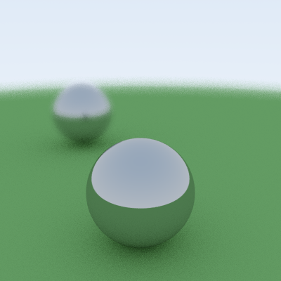

# lux

An implementation of [Ray Tracing in One Weekend][Shirley], in a purely
functional style. Here's a simple example of what it can do:

[Shirley]: https://raytracing.github.io/books/RayTracingInOneWeekend.html

## Installation

Follow the usual [stack](https://www.haskellstack.org) workflow.

## Usage

The output is sent to `stdout` as a [plain PPM]; redirect the output to a file
and open it in your favorite image viewer.

[plain PPM]: http://netpbm.sourceforge.net/doc/ppm.html
